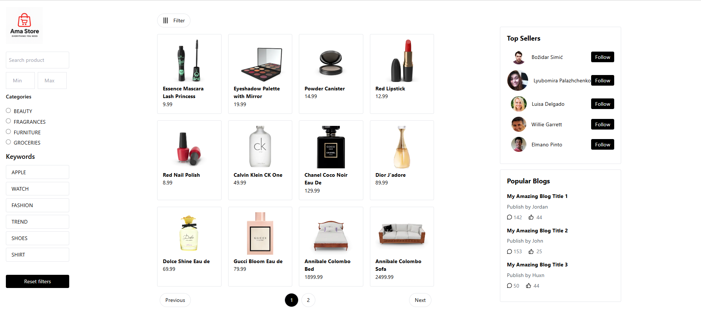

# Ama-store

Ama-store is an online storefront application designed to make buying and selling easy and efficient. The platform helps users quickly filter and find exactly what they want from a wide range of products.

## Features

- Intuitive product browsing
- Advanced filtering to help users find what they want
- Responsive design for all devices

  ## Screenshot



## Technology Stack

- **TypeScript**
- **JavaScript**
- **TailwindCSS**
- **HTML**

## Getting Started

### Prerequisites

- Node.js (version recommended: latest LTS)
- npm or yarn

### Installation

1. Clone the repository:
   ```bash
   git clone https://github.com/usorfaitheloho/Ama-store.git
   cd Ama-store
   ```

2. Install dependencies:
   ```bash
   npm install
   # or
   yarn install
   ```

3. Run the development server:
   ```bash
   npm start
   # or
   yarn start
   ```

4. Visit `http://localhost:3000` in your browser.

## Usage

- Browse products using categories and filters
- Create an account to manage your orders
- Add items to your cart and proceed to secure checkout

## Contributing

Contributions are welcome! Please open issues or pull requests for suggestions and improvements.

## License

This project currently does not specify a license.

---

**Ama-store** — Easily find what you want, whenever you want it.
